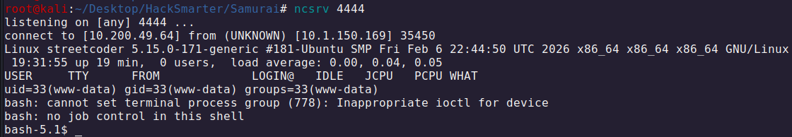
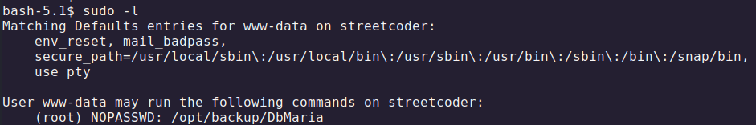
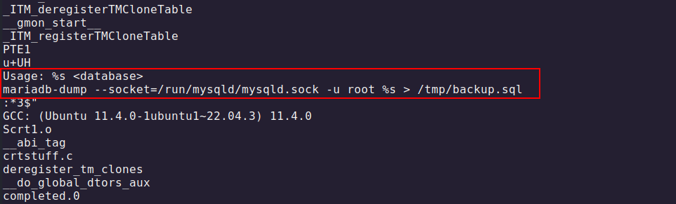
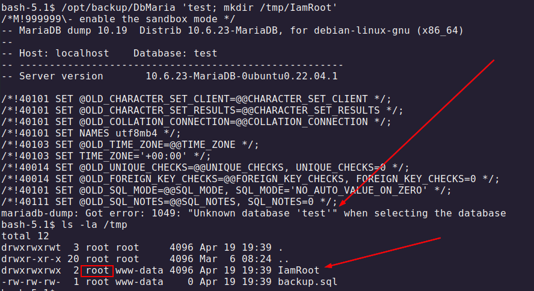
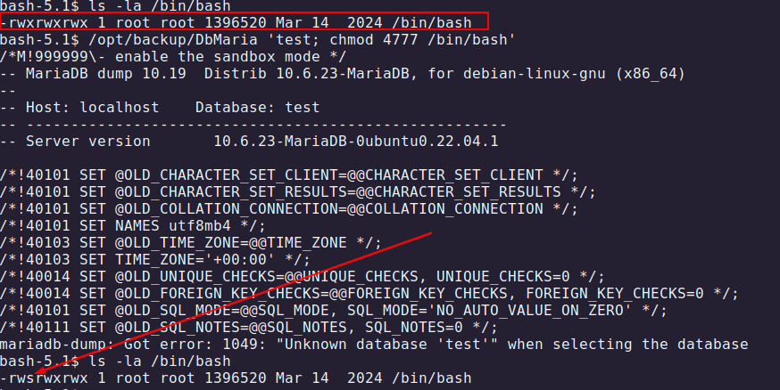
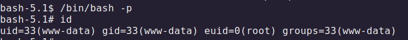
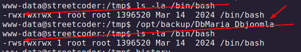
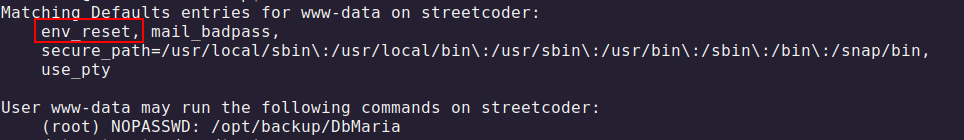

# Samurai

## Getting a Shell

We hop into `System --> Templates --> Administrator Template` and then replace `index.php` with PentestMonkey PHP Shell, pointing at port 4444 (or with a basic webshell). Once done, we switch a listener on our end and we'll receive a connection as `www-data`:



---

## Privilege Escalation

We discover our user has sudo rights to execute a script in `/opt/backup/DbMaria`



By using `strings` we discover a bit more of how's this script is used and most importantly how it works:



In this scenario, it's worthy to try inject a command in between. For instance, we could try to create a folder and check out whether it's created as root or not. In this case, we can notice that while the script fails because the database is not effectively found, the folder is created successfully:



>We cannot pass directly the command since we must interpose it with another logical operator for the command injection. In this case `test;` will fail, but what's after will be executed.

At this point, knowing we have execution as `root` we can try to modify the `/bin/bash` binary with a SUID to then escalate:

### Commands

```sh
/opt/backupDbMaria 'test; mkdir /tmp/IamRoot'
```

```sh
/opt/backupDbMaria 'test; chmod 4777 /bin/bash'
```



At this point we can simply escalate with `/bin/bash -p`:



---

## Privilege escalation through PATH Hijacking

Within `strings` we realize the binary calls the binary `mariadb-dump` without its absolute path. This means we shall be able to hijack the PATH by adding another folder to the PATH variable and add a malicious binary `mariadb-dump` onto that path.

To achieve that, we first create the malicious binary into the `/tmp` folder:

### Commands

```sh
echo -e -n '#!/bin/bash\nchmod 4777 /bin/bash' > mariadb-dump
```

```sh
export PATH=/tmp:$PATH
```

>It's CRUCIAL that we also give execution rights to the binary with `chmod +x mariadb-dump`, otherwise the PATH Hijacking won't execute.

Then, we add `/tmp` into the PATH variable:

Finally, we execute the script and validate that we gave the SUID to the `/bin/bash` binary:



>The binary must be executed with our user if the PATH Hijacking is possible. That's because we've set the env variable on the current user, not on root. Running script with sudo will inherit `root` PATH and won't have our hijacked PATH

Moreover, the `sudo -l` shows that the script has `env_reset`, so when we run it with sudo it won't inherit our user environment variables:



---


>[!notes]+
> We hop into `System --> Templates --> Administrator Template` and then replace `index.php` with PentestMonkey PHP Shell, pointing at port 4444 (or with a basic webshell). Once done, we switch a listener on our end and we'll receive a connection as `www-data`:
> 


> # Privilege Escalation
> 
> We discover our user as sudo rights to execute a script in `/opt/backup/DbMaria`
> 
> 


> 
> By using `strings` we discover a bit more of how's this script is used and most importantly how it works:
> 
> 


> 
> In this scenarios, it's worthy to try inject a command in between. For instance, we could try to create a folder and check out whether it's create as root or not. In this case, we can notice that while the script fails because the database is not effectively found, the folder is created successfully: 
> 
> 
> 
> 


> 
> >[!warning]
> >We cannot pass directly the command since we must interpole it with another logical operator for the command injection. In this case `test;` will fail, but what's after will be executed.
> 
> At this point, knowing we have execution as `root` we can try to modify the `/bin/bash` binary with a SUID to then escalate:
> 
> 
> 
> 


> 
> At this point we can simply escalate with `/bin/bash -p`:
> 
> 


> 
> 
> # Privilege escalation through PATH Hijacking
> 
> Within `strings` we realize the binary calls the binary  `mariadb-dump` without its absolute path. This means we shall be able to hijack the PATH by adding another folder to the PATH variable and add a malicious binary `mariadb-dump` onto that path.
> 
> To achieve that, we first create the malicious binary into the `/tmp` folder:
> 
> 
> 
> >[!warning]
> >It's CRUCIAL that we also give execution rights to the binary with `chmod +x mariadb-dump`, otherwise the PATH Hijacking won't execute.
> 
> Then, we add `/tmp` into the PATH variable:
> 
> 
> 
> Finally, we execute the script and validate that we gave the SUID to the `/bin/bash` binary:
> 
> 


> 
> >[!warning]
> >The binary must be executed with our user if the PATH Hijacking is possible. That's because we've set the env variable on the current user, not on root. Running script with sudo will inherit `root` PATH and won't have our hijacked PATH
> 
> Moreover, the `sudo -l` shows that the script has `env_reset`, so when we run it with sudo it won't inherit our user environment variables:
> 
> 


---

---

